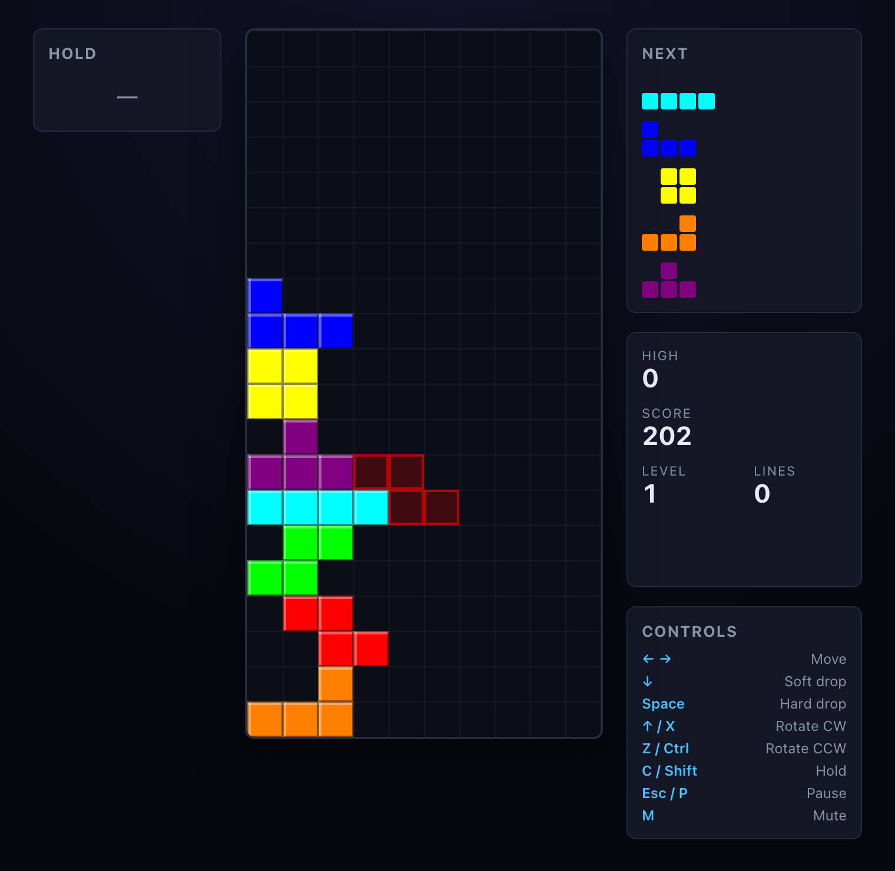

# Tetris

A modern, **guideline-compliant** Tetris built with **React 18 + TypeScript + Vite** —
no game engine, the logic is hand-written and unit-tested.

**▶ Play it: https://ivanbbaev.github.io/tetris/**



## Features

- **Guideline mechanics** — SRS rotation with the full wall-kick tables, 7-bag
  randomizer, hold (once per piece), ghost piece, delta-timed gravity, and lock delay
  with a move-reset limit.
- **Scoring** — T-spins (full + mini), Back-to-Back, combo, soft/hard drop, level
  progression.
- **Bonuses** — Perfect Clear, escalating Back-to-Back, golden blocks, and All-Spin.
- **Juice** — line-clear explosion, screen shake, and floating score popups.
- **6 skins** — Classic, Neon, Pastel, Mono, Game Boy, Vaporwave.
- Configurable DAS/ARR, ghost & sound toggles, persistent high score and settings.

## Controls

| Action | Keys |
|---|---|
| Move | ← → |
| Soft drop | ↓ |
| Hard drop | Space |
| Rotate CW | ↑ / X |
| Rotate CCW | Z / Ctrl |
| Hold | C / Shift |
| Pause | Esc / P |
| Mute | M |

## Getting started

Requires **Node ≥ 18** (Vite 5 / Vitest 2 will not run on older versions).

```bash
npm install
npm run dev        # dev server with HMR
npm test           # unit tests (Vitest)
npm run typecheck  # tsc --noEmit
npm run build      # production build → dist/
```

## Architecture

- **`src/game/`** — pure, React-free game logic (rotation, bag, board, scoring, state
  reducers), covered by Vitest unit tests.
- **`src/hooks/`** — the requestAnimationFrame game loop (gravity, lock delay, DAS/ARR)
  and keyboard input; a single mutable `useRef` is the source of truth, with discrete
  events going through pure reducers.
- **`src/components/`** — `<canvas>` board rendering plus the React HUD, menus and skins.

The board is drawn by the loop directly from the ref, independent of React's render
cycle; a throttled HUD snapshot keeps the React UI in sync.
